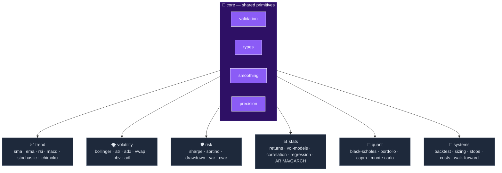
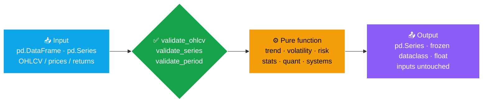

<div align="center">

# 📐 AlphaMetrics

### Pure, typed, TA-Lib-correct primitives for technical analysis & quantitative finance

*`numpy` / `pandas` / `scipy` in — `pd.Series`, frozen dataclasses & floats out.*


**36 functions · 7 subpackages · no global state · no I/O · validated against TA-Lib**

</div>

---

> **Pure library — no global state, no I/O.** No module reads `.env`, a database, the network or
> disk. Functions take a `pd.Series` / `pd.DataFrame`, validate it, and return **new** objects
> (`pd.Series`, frozen dataclasses, `float`) — your inputs are never mutated. You own the I/O and the
> thresholds (RSI/ADX/Bollinger). That makes every function deterministic, composable and trivially
> testable.

AlphaMetrics is a self-contained calculation core: technical indicators, risk & performance metrics,
time-series models, option pricing, portfolio optimization and a long-only backtest engine — each a
small, typed, side-effect-free function. Extracted from the `alphametrics` module of NarrativeAlpha
into a standalone repository.

## 🎯 What it is / What it's NOT

| ✅ What it **is** | ❌ What it's **NOT** |
|---|---|
| A **pure calculation library** (numpy/pandas/scipy) | A data fetcher — it does **no** network/disk I/O |
| **Deterministic & type-safe** (frozen dataclasses) | A live trading bot or order router |
| **Numerically correct** (Wilder vs EMA, TA-Lib-checked) | An investment recommendation engine |
| A **composable toolkit** you wire into your own pipeline | A framework that owns your data or config |

## 🗺️ Architecture

`core` provides the shared primitives — validation, return types, smoothing and float64 coercion —
that every domain subpackage builds on. There is **no** cross-coupling between domains.



## 🔄 How data flows

Every function follows the same contract: **validate → compute → return a fresh object**.



## 🧩 Use cases

> All snippets below run as a sequence — this first block sets up the sample data they share.
> Imports use the **flat scheme** (`from <subpackage>.<module> import ...`); see
> [Project layout & imports](#project-layout--imports).

```python
import numpy as np
import pandas as pd

# Synthetic OHLCV — swap in your own data (validate_ohlcv enforces high >= open/low/close)
rng = np.random.default_rng(42)
n = 250
idx = pd.date_range("2024-01-01", periods=n, freq="B")
close = pd.Series(100 + np.cumsum(rng.standard_normal(n)), index=idx)
high = close + rng.random(n)
low = close - rng.random(n)
openp = low + rng.random(n) * (high - low)
volume = pd.Series(rng.integers(100_000, 1_000_000, n).astype(float), index=idx)
ohlcv = pd.DataFrame({"open": openp, "high": high, "low": low, "close": close, "volume": volume})
```

### 📈 1. Technical indicators

Trend & volatility indicators over a validated OHLCV frame. Multi-output indicators return frozen
dataclasses (autocomplete + type safety), not loose DataFrames.

```python
from core.validation import validate_ohlcv
from trend.sma import sma
from trend.rsi import rsi
from trend.macd import macd
from volatility.bollinger import bollinger_bands
from volatility.atr import atr
from volatility.adx import adx

px = validate_ohlcv(ohlcv)                       # clean copy: float64, sorted, integrity-checked
sma_20 = sma(px["close"], period=20)             # pd.Series
rsi_14 = rsi(px["close"], period=14)             # pd.Series (Wilder smoothing)
m = macd(px["close"])                            # MACDResult(macd, signal, histogram)
bb = bollinger_bands(px["close"], 20, 2.0)       # BollingerResult(upper, middle, lower, pct_b, bandwidth)
atr_14 = atr(px["high"], px["low"], px["close"], period=14)
adx_14 = adx(px["high"], px["low"], px["close"], period=14)   # ADXResult(adx, plus_di, minus_di)
```

### 🛡️ 2. Risk & performance metrics

Turn a price series into returns, then score it. VaR/CVaR follow the loss-positive convention
(Basel-style); drawdown returns peak/trough/recovery dates.

```python
from stats.returns import simple_returns
from risk.sharpe import sharpe_ratio
from risk.sortino import sortino_ratio
from risk.drawdown import max_drawdown
from risk.var import var_historical
from risk.cvar import cvar_historical

rets = simple_returns(px["close"]).dropna()
sharpe = sharpe_ratio(rets)                       # float, annualized (252)
sortino = sortino_ratio(rets)                     # downside-only deviation
dd = max_drawdown(rets)                           # DrawdownResult(max_drawdown, peak_date, trough_date, ...)
var_95 = var_historical(rets, 0.95)               # positive = loss magnitude
cvar_95 = cvar_historical(rets, 0.95)             # expected shortfall (tail mean)
```

### 🧪 3. Backtest a signal strategy

A long-only engine with **anti-lookahead** baked in (`position.shift(1)`), per-bar transaction costs,
and Kelly-based position sizing.

```python
from systems.backtest import backtest_signals
from systems.costs import TransactionCostModel
from systems.position_sizing import kelly_discrete, position_size

fast, slow = sma(px["close"], period=10), sma(px["close"], period=30)
entries = (fast > slow) & (fast.shift(1) <= slow.shift(1))    # golden cross
exits = (fast < slow) & (fast.shift(1) >= slow.shift(1))      # death cross

costs = TransactionCostModel(commission_per_share=0.005, half_spread_bps=2.5)
bt = backtest_signals(px["close"], entries, exits, init_cash=10_000, cost_model=costs)
# bt.total_return · bt.annual_return · bt.win_rate · bt.n_trades · bt.equity_curve

size = position_size(kelly_discrete(win_rate=0.55, avg_win=1.8, avg_loss=1.0))   # half-Kelly, capped 25%
```

### ⏳ 4. Time-series models — ARIMA / GARCH

Volatility & mean models. These live in `stats.timeseries` and require the optional **`stats`** extra
(`statsmodels`, `arch`, `pmdarima`); each raises a clear `ImportError` if the dependency is missing.

```python
from stats.returns import log_returns
from stats.timeseries import fit_arima, fit_garch, auto_arima

r = log_returns(px["close"]).dropna()
arima = fit_arima(r, order=(1, 0, 1))             # ARIMAResult(aic, bic, params, model)
garch = fit_garch(r * 100, p=1, q=1)              # GARCHResult(conditional_volatility, converged, ...)
best = auto_arima(r, max_p=3, max_q=3)            # pmdarima stepwise search (BIC)
```

### 🎲 5. Quant finance & options

Black-Scholes pricing & Greeks, implied vol, Markowitz optimization, CAPM beta and Monte-Carlo paths.

```python
from quant.black_scholes import bs_price, bs_greeks, implied_vol
from quant.portfolio import max_sharpe_portfolio
from quant.capm import capm_beta
from quant.monte_carlo import gbm_paths

fair = bs_price(S=100, K=105, T=0.5, r=0.04, sigma=0.2, option_type="call")
greeks = bs_greeks(100, 105, 0.5, 0.04, 0.2)      # BSResult(price, delta, gamma, theta, vega, rho)
iv = implied_vol(market_price=fair, S=100, K=105, T=0.5, r=0.04)

mu, cov = np.array([0.10, 0.12, 0.08]), np.diag([0.04, 0.06, 0.03])
opt = max_sharpe_portfolio(mu, cov)               # PortfolioResult(weights, expected_return, volatility, sharpe)

mkt = simple_returns(px["close"]).dropna()
beta = capm_beta(mkt * 1.2 + 0.001, mkt)          # BetaResult(beta, alpha, r_squared, adjusted_beta)
paths = gbm_paths(S0=100, mu=0.08, sigma=0.2, T=1.0, n_steps=252, n_paths=1000, seed=7)
```

## 📚 Function map

Quick reference. Full formulas, edge cases and TA-Lib validation notes live in
[`docs/AlphaMetrics.md`](docs/AlphaMetrics.md). Items marked `*` need the optional `stats`/`sklearn` extras.

| Subpackage | Public functions | Typical return |
|---|---|---|
| 🧱 **core** | `validate_ohlcv` · `validate_series` · `validate_period` · `ensure_float64` · `wilder_smooth` · `ema_smooth` | `pd.Series` / `pd.DataFrame` |
| 📈 **trend** | `sma` · `ema` · `rsi` · `macd` · `stochastic` · `stochastic_fast` · `ichimoku` | `pd.Series` · `MACDResult` · `StochasticResult` · `IchimokuResult` |
| 🌪️ **volatility** | `bollinger_bands` · `true_range` · `atr` · `adx` · `vwap` · `obv` · `adl` | `pd.Series` · `BollingerResult` · `ADXResult` |
| 🛡️ **risk** | `sharpe_ratio` · `sortino_ratio` · `max_drawdown` · `var_historical/parametric/monte_carlo` · `cvar_historical/parametric` | `float` · `DrawdownResult` |
| 📊 **stats** | `simple_returns` · `log_returns` · `rolling/ewma/parkinson_volatility` · `correlation_matrix` · `simple_ols` · `fit_arima*` · `fit_garch*` · `auto_arima*` | `pd.Series` · `RegressionResult` · `ARIMAResult*` · `GARCHResult*` |
| 🎲 **quant** | `bs_price` · `bs_greeks` · `implied_vol` · `max_sharpe_portfolio` · `min_variance_portfolio` · `capm_beta` · `rolling_beta` · `gbm_paths` · `bootstrap_paths` | `float` · `BSResult` · `PortfolioResult` · `BetaResult` · `np.ndarray` |
| 🧪 **systems** | `backtest_signals` · `TransactionCostModel` · `kelly_discrete/continuous` · `position_size` · `fixed_stop` · `trailing_stop` · `atr_stop` · `OrderSimulator` · `rolling/expanding_walk_forward` | `BacktestResult` · `StopResult` · `FillResult` · `float` |

## 🎯 Numerical correctness

The most common TA bug is confusing **Wilder smoothing** (`α = 1/N`, used by RSI/ATR/ADX) with the
**standard EMA** (`α = 2/(N+1)`). AlphaMetrics centralizes both in `core/smoothing.py` and uses each
deliberately, so values match TA-Lib where a reference exists. All inputs pass through centralized
validation — functions raise `ValueError`/`TypeError` on bad data rather than silently returning `NaN`
(NaNs in output only ever come from an indicator's natural warm-up period).

---

# 🛠️ Usage & development

## Installation

Requires **Python ≥ 3.12**.

```bash
python -m venv .venv
# Windows:  .venv\Scripts\Activate.ps1
# Unix:     source .venv/bin/activate

pip install -e ".[dev,stats]"
```

Reproducible alternative via pinned lock files:

```bash
pip install -r requirements.txt        # runtime (includes the stats stack)
pip install -r requirements-dev.txt    # + dev tooling (pytest, black, ruff, mypy)
```

## Project layout & imports

```
src/         core · trend · volatility · risk · stats · quant · systems   ← Sources Root
tests/       pytest suite (mirrors src/), fixtures in conftest.py
docs/        AlphaMetrics.md — full reference
```

`src/` is a **flat layout**: each subpackage is a top-level importable package. Import directly:

```python
from trend.sma import sma
from risk.sharpe import sharpe_ratio
```

> In PyCharm, mark `src/` as **Sources Root** (right-click → *Mark Directory as → Sources Root*) so the
> IDE resolves these imports. On the CLI the editable install and `pytest` (`pythonpath = ["src"]`)
> handle it automatically.

## Optional dependencies

The core (`numpy`, `pandas`, `scipy`) covers everything except a few advanced models, which are guarded
by `ImportError` so the library works without them:

| Extra | Adds | Unlocks |
|---|---|---|
| `stats` | `statsmodels` · `arch` · `pmdarima` | `stats.timeseries` (`fit_arima`, `fit_garch`, `auto_arima`), HAC regression |
| `sklearn` | `scikit-learn` | `stats.correlation.covariance_shrinkage` (Ledoit-Wolf) |

```bash
pip install -e ".[stats]"      # or ".[sklearn]" / ".[all]"
```

## Running tests

```bash
pytest                 # 125 tests across the 7 subpackages
```

## Dev tooling

```bash
ruff check .           # lint
black .                # format (line length 99)
mypy src               # strict type checking
```

## Documentation

Full reference — formulas, edge cases, Wilder-vs-EMA deep dive, TA-Lib validation —
in [`docs/AlphaMetrics.md`](docs/AlphaMetrics.md).

## License

To be defined — no `LICENSE` file yet. Add one before publishing or sharing.
